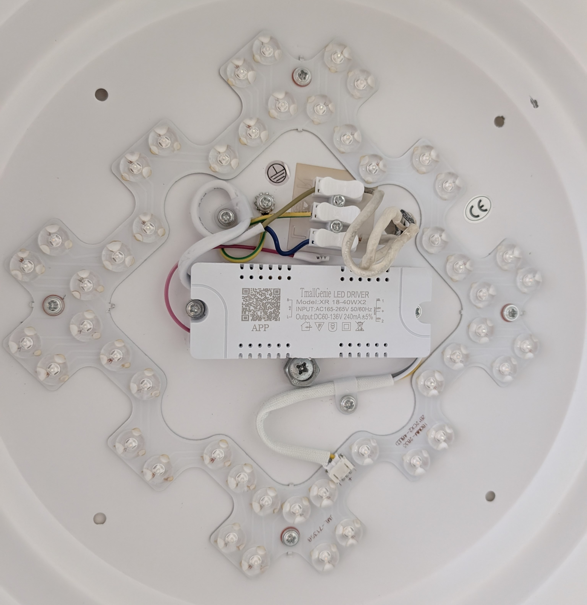

# ESPHome TmallGenie XR 18-40WX2

An ESPHome external component for controlling an already-provisioned Alibaba/Tmall Genie Bluetooth Mesh LED driver from an ESP32. It was reverse-engineered against the controller labelled `TmallGenie LED DRIVER`, model `XR 18-40WX2`, together with a `KLD-12KEY` / `FN2557` remote.

The component talks to the lamp directly over Bluetooth Mesh. It does not emulate the remote's separate radio protocol, require a cloud connection after setup, or install a web dashboard.

> [!NOTE]
> On/off control and the acknowledged power state after ESPHome commands are verified on the reference hardware. The driver does not expose changes made with its separate physical remote. Brightness, color-temperature, preset, vendor-command, and timer mappings are implemented from the reverse-engineered protocol but have not yet been successfully verified on this lamp. They are therefore commented out in the example configuration.

## Reference hardware



The photographed driver is marked:

- Product: `TmallGenie LED DRIVER`
- Model: `XR 18-40WX2`
- Input: AC 165–265 V, 50/60 Hz
- Output: DC 60–136 V, 240 mA ±5%
- LED output: two CCT channels (`LED1`, common positive, and `LED2`)

The repository targets the Bluetooth Mesh controller inside this driver rather than a particular ceiling-light enclosure. The same controller may be sold in different OEM fixtures.

## Features

Verified on the reference hardware:

- Acknowledged on/off commands with queueing and retries
- Acknowledged power state after commands from ESPHome
- Persistent last confirmed state across ESP32 restarts
- Persistent Mesh sequence-number ranges to survive power cycles

Implemented but not yet verified on the reference hardware:

- Absolute brightness from 0–100%
- Color temperature through the Bluetooth Mesh CTL model
- Day and night presets
- AliGenie `MainLight` vendor commands
- Local 60-second off timer

The optional button mapping models all twelve positions of the physical remote. Button 5 (`SETUP`) deliberately does nothing: pairing and provisioning are destructive operations and should not be available through an accidental Home Assistant button press.

## Requirements

- An ESP32 with Bluetooth; tested on a LOLIN D32 Pro (classic ESP32)
- ESPHome with the `esp-idf` framework; tested with ESPHome 2026.9.0 / ESP-IDF 5.5.5
- A TmallGenie `XR 18-40WX2` driver, or compatible Alibaba/Tmall Genie Bluetooth Mesh hardware
- The lamp's NetKey, AppKey, key indexes, IV Index, and unicast address

ESP8266 and ESP32-S2 are not supported because they have no Bluetooth radio. Other Bluetooth-capable ESP32 variants are not yet tested.

## ESPHome example

The external component loads only the implementation. The consuming device configuration owns all entity IDs, names, and optional buttons. Set the lamp-specific Mesh values in the `substitutions` block. Keep only the Wi-Fi and Home Assistant API credentials in `secrets.yaml`, and keep that file out of version control.

```yaml
substitutions:
  mesh_net_key: "<REDACTED-32-HEX-CHARACTERS>"
  mesh_app_key: "<REDACTED-32-HEX-CHARACTERS>"
  mesh_net_idx: "0x000"
  mesh_app_idx: "0x000"
  mesh_iv_index: "0x<REDACTED-8-HEX>"
  mesh_target_unicast: "0x<REDACTED-4-HEX>"
  mesh_controller_unicast: "0x<CHOOSE-A-UNIQUE-ADDRESS>"

esphome:
  name: xr1840wx2-controller
  friendly_name: TmallGenie XR 18-40WX2

esp32:
  board: lolin_d32_pro
  framework:
    type: esp-idf

external_components:
  - source: github://ciriousjoker/esphome_tmallgenie_xr1840wx2@v0.1.0
    components: [ble_mesh_light]
    refresh: 1d

# Loads the component and its required ESP-IDF Bluetooth Mesh options.
ble_mesh_light:

logger:
  level: INFO

api:
  encryption:
    key: !secret api_encryption_key

ota:
  - platform: esphome

wifi:
  ssid: !secret wifi_ssid
  password: !secret wifi_password

light:
  - platform: ble_mesh_light
    id: ceiling_lamp
    output_id: mesh_controller
    name: Ceiling Lamp
    net_key: ${mesh_net_key}
    app_key: ${mesh_app_key}
    net_idx: ${mesh_net_idx}
    app_idx: ${mesh_app_idx}
    iv_index: ${mesh_iv_index}
    target_address: ${mesh_target_unicast}
    controller_address: ${mesh_controller_unicast}

binary_sensor:
  - platform: ble_mesh_light
    ble_mesh_light_id: mesh_controller
    name: Ceiling Lamp Power

button:
  - platform: ble_mesh_light
    ble_mesh_light_id: mesh_controller
    remote_button: "on"
    name: "On"
  - platform: ble_mesh_light
    ble_mesh_light_id: mesh_controller
    remote_button: "off"
    name: "Off"

  # The remaining mappings are implemented but not yet verified on the
  # reference hardware. Uncomment them individually after testing.

  # - platform: ble_mesh_light
  #   ble_mesh_light_id: mesh_controller
  #   remote_button: brightness_up
  #   name: "Brightness Up"
  # - platform: ble_mesh_light
  #   ble_mesh_light_id: mesh_controller
  #   remote_button: temperature_down
  #   name: "Color Temperature Warmer"
  # - platform: ble_mesh_light
  #   ble_mesh_light_id: mesh_controller
  #   remote_button: setup
  #   name: "Setup (Disabled)"
  #   entity_category: diagnostic
  # - platform: ble_mesh_light
  #   ble_mesh_light_id: mesh_controller
  #   remote_button: temperature_up
  #   name: "Color Temperature Cooler"
  # - platform: ble_mesh_light
  #   ble_mesh_light_id: mesh_controller
  #   remote_button: brightness_down
  #   name: "Brightness Down"
  # - platform: ble_mesh_light
  #   ble_mesh_light_id: mesh_controller
  #   remote_button: day_mode
  #   name: "Day Mode"
  # - platform: ble_mesh_light
  #   ble_mesh_light_id: mesh_controller
  #   remote_button: night_mode
  #   name: "Night Mode"
  # - platform: ble_mesh_light
  #   ble_mesh_light_id: mesh_controller
  #   remote_button: main_light_on
  #   name: "Main Light On"
  # - platform: ble_mesh_light
  #   ble_mesh_light_id: mesh_controller
  #   remote_button: main_light_off
  #   name: "Main Light Off"
  # - platform: ble_mesh_light
  #   ble_mesh_light_id: mesh_controller
  #   remote_button: off_timer_60s
  #   name: "Off Timer 60 Seconds"
```

The remaining `secrets.yaml` contains only the normal ESPHome credentials:

```yaml
wifi_ssid: "<REDACTED>"
wifi_password: "<REDACTED>"
api_encryption_key: "<REDACTED-BASE64-KEY>"
```

Although the Mesh values are convenient to keep directly in the device YAML, real NetKey and AppKey values grant access to the Mesh network. Do not commit a populated personal device configuration to a public repository.

The component adds its required ESP-IDF `sdkconfig` options itself. Do not copy the old debug `sdkconfig_options` block into your device YAML.

## Obtaining the Mesh values with Android and ADB

The tested Tmall Genie app contains a local Mesh provisioner. Its diagnostic output reveals the provisioning values while adding or reconnecting the lamp. App releases and UI labels can change, but this was verified with Tmall Genie 8.27.1.

> Warning: adding the lamp in the vendor app provisions it and writes persistent state to the lamp. Existing pairing may change. Only do this with a lamp you are authorized to configure. The resulting log contains credentials that grant control of the Mesh network; never publish it.

1. Install the Tmall Genie / TM-Tsmall Genie app on Android, sign in, and grant Nearby Devices/Bluetooth scanning permission.
2. Enable Developer options and USB debugging, connect the phone, and verify it with `adb devices`.
3. Enable the app's provisioning logger and clear the old Android log:

   ```sh
   adb shell setprop debug.provision.log enable
   adb logcat -G 32M
   adb logcat -c
   ```

4. Start a capture and leave it running:

   ```sh
   adb logcat -v threadtime > tmall-mesh.log
   ```

5. In the app, scan for and add the lamp. If it is already registered, open it and change one property so the app reconnects and refreshes its Mesh information. Stop `adb logcat` with Ctrl-C afterward.
6. Disable the extra logger and search the local capture:

   ```sh
   adb shell setprop debug.provision.log disable
   rg -i 'networkKey|mAppKey|appKeyIndex|netKeyIndex|plainData|unicastAddress|Src address|iv.?index' tmall-mesh.log
   ```

Map the results as follows:

| ESPHome value | Where it appears |
| --- | --- |
| `net_key` | `networkKey:` or the first 16 bytes of `plainData` |
| `app_key` | `mAppKey = ...` or the provision-info key object |
| `net_idx` / `app_idx` | `netKeyIndex` / `appKeyIndex`; commonly zero, but use the logged values |
| `iv_index` | `ivIndex`, or bytes 19–22 of the 25-byte provisioning `plainData` |
| `target_address` | The lamp's assigned `unicastAddress`; also visible in `Send data to node(...)` |
| `controller_address` | Choose a new, unused unicast address; do not reuse the lamp address, its next CTL element, or the app's `Src address` |

A provisioning `plainData` value follows the Bluetooth Mesh layout:

```text
NetKey (16 bytes) | NetKey index (2) | Flags (1) | IV Index (4) | lamp unicast (2)
```

The lamp's DeviceKey and the app's session keys may also appear in the log, but this component neither needs nor accepts them. It sends access messages with the AppKey and never configures the lamp.

## Configuration reference

| Option | Required | Description |
| --- | --- | --- |
| `net_key` | yes | 16-byte Bluetooth Mesh NetKey as 32 hexadecimal characters |
| `app_key` | yes | 16-byte AppKey as 32 hexadecimal characters |
| `target_address` | yes | Primary unicast address of the lamp |
| `controller_address` | yes | Unique unicast address used by this ESP32 |
| `iv_index` | no | Current network IV Index; defaults to `0` |
| `net_idx` | no | NetKey index; defaults to `0` |
| `app_idx` | no | AppKey index; defaults to `0` |

Only one `ble_mesh_light` instance is supported per ESP32.

## Button mapping

| Physical position | Configuration value | Function | Status |
| --- | --- | --- | --- |
| 01 | `on` | Generic OnOff on, acknowledged with retries | Verified |
| 02 | `off` | Generic OnOff off, acknowledged with retries | Verified |
| 03 | `brightness_up` | Light Lightness Actual +20 percentage points | Unverified |
| 04 | `temperature_down` | Light CTL, 10 percentage points warmer | Unverified |
| 05 | `setup` | Intentionally disabled | No-op by design |
| 06 | `temperature_up` | Light CTL, 10 percentage points cooler | Unverified |
| 07 | `brightness_down` | Light Lightness Actual −20 percentage points | Unverified |
| 08 | `day_mode` | 100%, coolest temperature, on | Unverified |
| 09 | `night_mode` | 5%, warmest temperature, on | Unverified |
| 10 | `main_light_on` | AliGenie vendor attribute `0x0534`, on | Unverified |
| 11 | `main_light_off` | AliGenie vendor attribute `0x0534`, off | Unverified |
| 12 | `off_timer_60s` | Local timer, then Generic OnOff | Unverified |

## Operational notes

- Never run two controllers with the same `controller_address`. Bluetooth Mesh replay protection requires each sender address to be unique.
- Do not erase the ESP32's NVS and then reuse the same controller address. NVS stores the next sequence-number range; after a full flash erase, select a fresh controller address.
- The component uses an ESP-IDF-internal network-entry helper because the public provisioner API cannot attach a controller to a Mesh created by another provisioner. This dependency is isolated in `ble_mesh_bridge.c`; pinning a release tag protects normal builds from upstream changes.
- The tested driver acknowledges Generic OnOff Set but does not answer Generic OnOff, Lightness, CTL, or AliGenie attribute queries. The component persists the last confirmed state across ESP32 restarts, but changes made with the separate physical remote cannot be reflected in Home Assistant.
- Generic on/off is confirmed on the photographed `XR 18-40WX2`. Brightness, CTL, presets, and `MainLight` remain experimental until independently verified on working hardware.

## Local development

Use a local source while editing:

```yaml
external_components:
  - source:
      type: local
      path: components
    components: [ble_mesh_light]
```

Then validate and build with `esphome config your-device.yaml` and `esphome compile your-device.yaml`.

## License

MIT
